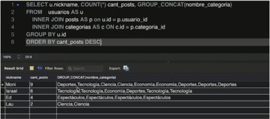

# SQL

[Version en notion](https://www.notion.so/SQL-b64a58655086465ab84508b253ccc65c) 

- BREVE HISTORIA DE SQL
    
    SQL (Structured Query Language - Lenguaje de consulta estructurada) es un lenguaje que se basó en 2 principios fundamentales:
    
    - Teoría de conjuntos.
    - Álgebra relacional de Edgar Codd (científico informático inglés).
    
    SQL fue creada en 1974 por IBM
    
    Originalmente fue llamado SEQUEL, posteriormente se cambió el nombre por problemas de derechos de autor.⠀
    
    Relation Company (actualmente con el nombre Oracle) creó el software Oracle V2 en 1979. Más adelante SQL se convertiría en un lenguaje estándar que unifica todo dentro de las bases de datos relacionales, se convierte en una norma ANSI o ISO.
    
    Base de datos: Una base de datos es una colección de datos que están organizados en una manera que facilita el acceso sencillo, así como la administración y actualización eficiente. Está constituida por tablas que almacenan información relevante.
    
    formato estructurado: columnas y filas.
    
    Una tabla tiene un número de columnas especificado, pero puede tener cualquier número de filas.
    
- DEFINICIONES
    
    Claves primarias: campo en la tabla que identifica de forma **única** los registros de la tabla. Esta se define durante la creación de la tabla, utilizando la palabra clave PRIMARY KEY(*nombre la clave primaria*).
    
    - Debe contener un valor único para cada fila
    - No puede contener valores NULL
    - Cada tabla está limitada a UNA clave primaria.
    - Un ejemplo sería el CCMS o ID.
    - El UserID es la mejor opción para utilizar como clave primaria.
    
    SQL: Structured Query Language (Lenguaje de Consulta Estructurada en español). Es utilizado para acceder y manipular una base de datos. MySQL es un programa que entiende SQL. SQL puede:
    
    - Insertar, actualizar o borrar registros en una base de datos.
    - Crear nuevas bases de datos, tablas, procedimientos almacenados, vistas.
    - Recuperar datos de una base de datos, etc.
    
    Structured Query Language: Tiene una estructura clara y fija. Su objetivo es hacer un solo lenguaje para consultar cualquier manejador de bases de datos volviéndose un gran estándar. Ahora existe el NOSQL o Not Only Structured Query Language que significa que no sólo se utiliza SQL en las bases de datos no relacionales (por ejemplo, Cassandra o Deep Query).
    
    SQL tiene 2 grandes sublenguajes:
    
    1. **DDL o Data Definition Language:** nos ayuda a crear la **estructura** de una base de datos. Existen 3 grandes comandos:
        - Create: Nos ayuda a crear bases de datos, tablas, vistas, índices, etc.
        - Alter: ayuda a alterar o modificar entidades.
        - Drop: Nos ayuda a borrar. Hay que tener cuidado al utilizarlo.
        
        Manipularemos 3 objetos con el lenguaje DDL:
        
        - Database o bases de datos (schema): Repositorio de datos.
        - Table o tablas: son la proyección o traducción a SQL de las entidades.
        - View o vistas: se ofrece la proyección de los datos de la base de datos de forma entendible.
    2. **DML o Data Manipulation Language:** trata del contenido de la base de datos. Nos ayuda a meter, actualizar, extraer o borrar datos de las tablas que ya generamos previamente con el lenguaje de DDL. Existen 4 grandes comandos:
        - Insert: inserta, agrega un nuevo registro o tupla a nuestra tabla en la base de datos.
        - Update: actualiza o modifica los datos que ya tenemos. No va a insertar los datos si no existen ya en nuestra tabla sino que va a tomar un dato que nosotros le indiquemos y ese renglón lo va a cambiar. Hay varios tipos de cambios:
            1. A la tabla indicandole cada detalle que hay que cambiar.
            2. A un WHERE muy general. Casi siempre la query te frena ya que hace un cambio masivo.
            3. Sin decirle a qué registro quiero que lo haga.
            - SET: nos indica qué campo va a tener qué valor.
            - Se usa la cláusula WHERE para indicarle el renglón o donde encuentre una información específica.
        - Delete: borra el contenido de una tabla.
            - DELETE FROM *nombre_tabla* WHERE condición;
            - Si no le ponemos la condición nos va a borrar toda la tabla.
        - Select: Trae información de la base de datos. Muchas veces para generar una vista o algunas otras cuestiones necesitamos primero traer la información y ponerlas en otro lado.
            - SELECT *qué_campos_quiero_ver* FROM *de_donde_quiero_ver_esos_cambios*;
    
    Pasos lógicos:
    
    1. Crear la base de datos:
        - CREATE SCHEMA ___ DEFAULT CHARACTER SET ut8; //este se usa usando click derecho
        - CREATE DATABASE ____;
        - USE DATABASE ____; //quiero utilizar esta base de datos por defecto.
    2. Crear una tabla o entidad:
        - CREATE TABLE n*ombredebasededatos.nombredetabla* (*nombredecolumna* DataType,….,PRIMARY KEY(__) );
        - Le damos click al nombre del schema > click derecho donde dice table > crear tabla.
            1. Recordemos que la primera columna de valores que se crea es la PK, y debe ser NN también.
            2. AI: autoincremento.
    3. Crear una vista: toma datos de la base de datos, la pone de una forma presentable y convertirlas en algo que podamos consultar de manera recurrente. Tiene 2 partes centrales:
        - Asignarle un nombre (por convención, el nombre de la vista empieza con v_… para no confundirla con una tabla):
            
            USE ‘*nombredebase*’;
            
            CREATE VIEW ‘*v_nombredelavista*’ AS
            
            SELECT * FROM *nombredebase.nombredetabla*;
            
        - nos vamos a donde dice view > click derecho > create view > pegamos el comando SELECT * FROM *nombredebase.nombredetabla*;
    4. ALTER TABLE: nos permite modificar la tabla.
        - Click derecho en la tabla>alter table.
    5. DROP: Borrar, desaparecer.
        - DROP TABLE *nombredetabla*;
        - DROP DATABASE *nombredebase*;
        - click derecho en la tabla > drop table
        - click derecho en la base de datos > drop database
    
    Múltiples consultas: SQL permite ejecutar múltiples consultas o comandos en la misma línea. Cada consulta o declaración se finaliza con un ; para indicar que la declaración está completa y lista para ser interpretada; luego le damos enter y escribimos la siguiente consulta.
    
    Vistas: Es una tabla virtual que está basada en el conjunto resultante de una declaración SQL. Una vista contiene filas y columnas, al igual que una tabla real. Los campos en una vista son campos de una o más tablas reales en la base de datos.
    
    Las vistas nos permiten:
    
    - Estructurar datos de una forma que los usuarios o clases de usuarios encuentren natural o intuitivo.
    - Restringir acceso a los datos de tal manera que un usuario pueda ver y (algunas veces) modificar exactamente lo que necesita y nada más.
    - Resumir datos de varias tablas y utilizarlos para generar reportes.
    - Siempre muestra datos actualizados. El motor de la base de datos utiliza la declaración SQL de la vista para recrear los datos cada vez que un usuario consulta una vista.
    - **Crear una vista:**
    
    CREATE VIEW *nombredevista* AS
    
    SELECT *nombredecolumna(s)*
    
    FROM *nombredetabla*
    
    WHERE condición ;
    
    - **Actualizar una vista:**
    
    CREATE OR REPLACE VIEW nombredevista AS
    
    SELECT *nombredecolumna(s)*
    
    FROM *nombredetabla*
    
    WHERE condición ;
    
    - **Eliminar una vista:**
    
    DROP VIEW *nombredevista* ;
    
    Nested Queries: Los Nested queries o queries anidados significan que dentro de un query podemos hacer otro query. Esto sirve para hacer join de tablas, estando una en memoria. También teniendo un query como condicional del otro. Se usan estos nested queries cuando tienes un problema que no se puede solucionar simplemente consultando tu tabla y necesitas hacer una agregación u otro tipo de operación que viene de otra tabla o de tu misma tabla pero que cuando lo agrupas necesitas hacer condiciones separadas.
    
    Este proceso puede ser tan profundo como quieras, teniendo infinitos queries anidados.
    
    Se le conoce como un producto cartesiano ya que se multiplican todos los registros de una tabla con todos los del nuevo query. Esto provoca que el query sea difícil de procesar por lo pesado que puede resultar. Cada vez que se aumente el registro en el query padre, se va a aumentar n veces en el query hijo, se multiplica y crece exponencialmente.
    
    De pregunta a Query: 
    
    - SELECT: Lo que quieres mostrar
    - FROM: De dónde voy a tomar los datos
    - WHERE: Los filtros de los datos que quieres mostrar
    - GROUP BY: Los rubros por los que me interesa agrupar la información
    - ORDER BY: El orden en que quiero presentar mi información
    - HAVING: Los filtros que quiero que mis datos agrupados tengan
    - GROUP_CONCAT toma el resultado del query y lo pone como campo separado por comas.
    
    
    
- COMANDOS SQL BÁSICOS.
    - SHOW: muestra información contenida en la base de datos y sus tablas. Te permite hacer seguimiento a los contenidos de tu base de datos y te recuerda la estructura de tus tablas.
        - SHOW DATABASES: lista todas las bases de datos.
        - SHOW TABLES: muestra todas las tablas en la base de datos MySQL actualmente seleccionada.
        - SHOW COLUMNS: muestra información acerca de las columnas en una tabla dada.
            - SHOW COLUMNS FROM _________ (nombre de la tabla).
    - SELECT: selecciona datos de una base de datos. El resultado es almacenado en una tabla resultante, la cual es llamada el **conjunto resultante**. Una consulta puede recuperar información de columnas seleccionadas o de todas las columnas en la tabla. Para crear una declaración SELECT, especifica el(los) nombre(s) de la(s) columna(s) que necesitas de la tabla.
        - **Estructura:** SELECT + **una o más** columnas de las cuales los datos son recuperados (cada columna se separa con una coma (,) excepto después del **último** nombre de columna + FROM + nombre de la tabla de la cual la información es recuperada.
            - Para recuperar toda la información contenida en la tabla: SELECT + ***** + FROM + nombre de la tabla de la cual la información es recuperada.
- LOS COMANDOS NO TAN BÁSICOS.
    - DISTINCT: es utilizada en conjunto con SELECT para eliminar todos los registros duplicados y retornar sólo los registros **únicos**.
        - **Estructura:** SELECT DISTINCT + nombre(s) de la(s) columna(s) que quiero + FROM + nombre de la tabla.
    - LIMIT: Por defecto, todos los resultados que satisfacen las condiciones especificadas en la declaración SQL son retornados. Sin embargo, algunas veces necesitamos recuperar sólo un subconjunto de registros. En MySQL, esto se logra utilizando la palabra clave LIMIT.
        - **Estructura:** SELECT + nombre(s) de la(s) columna(s) que quiero + FROM + nombre de la tabla + LIMIT [número de registros] (sin escribir []);
            - Cuando queremos de un desplazamiento particular: SELECT + nombre(s) de la(s) columna(s) que quiero + FROM + nombre de la tabla + [posición del primer registro que queremos] + LIMIT [número de registros];
            - MySQL comienza a contar desde cero, lo que significa que el desplazamiento de la primera fila es 0, no 1.
    - ORDER BY: es utilizado con SELECT para ordenar los datos recuperados en orden ascendente por defecto. Tiene que ver con el ordenamiento de los datos dependiendo de los criterios que quieras usar.
        - Criterios:
            - ASC sirve para ordenar de forma ascendente. ASC y DESC ordena de forma alfabética si es texto.
            - DESC sirve para ordenar de forma descendente.
            - LIMIT se usa para limitar la cantidad de resultados que arroja el query.
            - HAVING tiene una similitud muy grande con WHERE, sin embargo el uso de ellos depende del orden. Cuando se quiere seleccionar tuplas agrupadas únicamente se puede hacer con HAVING. Va justo después del GROUP BY.
        - **Estructura:** SELECT + nombre(s) de la(s) columna(s) que quiero + FROM + nombre de la tabla + ORDER BY + columna de datos que quiero ordenar;
            - Para ordenar múltiples columnas (separa la lista de columnas posterior a ORDER BY con comas: SELECT + nombre(s) de la(s) columna(s) que quiero + FROM + nombre de la tabla + ORDER BY + columnas de datos que quiero ordenar;
                - Cuando hay valores repetidos en la primera columna, la segunda se encarga de organizarlos en forma ascendente. Ordenará por la primera columna listada, luego por la segunda y así sucesivamente.
    - GROUP BY: tiene que ver con agrupación. Indica a la base de datos qué criterios debe tener en cuenta para agrupar. Es útil para saber la cantidad de un datos agregados (un resumen).
- COMANDO DE DATOS
    
    CREATE TABLE: crear una tabla básica implica nombrar la tabla y definir sus columnas y el tipo de dato de cada columna.
    
    - Estructura: CREATE TABLE + nombre de tabla + **(** *nombredecolumna1* *tipodedato*(tamaño), (*nombredecolumna2* *tipodedato*(tamaño), … , (*nombredecolumnaN tipodedato*(tamaño) **)** ;
    - **Tipos de datos:** especifican el tipo para una columna particular.
        - NUMÉRICOS:
            - int: números enteros con o sin signo.
            - FLOAT(M,D): un número de punto flotante que no puede ser sin signo. M es la longitud de muestra y D es el número de decimales.
            - DOUBLE(M,D): un número de punto flotante de doble precisión que no puede ser sin signo. M es la longitud de muestra y D es el número de decimales.
        - FECHA Y HORA:
            - DATE: fecha en formato AAAA-MM-DD
            - DATETIME: una combinación de fecha y hora de formato AAAA-MM-DD HH:MM:SS
            - TIMESTAMP: una marca de tiempo es calculada desde la medianoche del 1 de enero de 1970.
            - TIME: almacena la hora en formato HH:MM:SS
        - TIPO STRING:
            - CHAR(M): cadena de texto de longitud preestablecida. El tamaño es especificado entre paréntesis. Máximo 255 bytes.
            - VARCHAR(M): Cadena de texto de longitud variable (almacena los caracteres). Tú especificas el número de caracteres en los paréntesis (M) después del tipo de dato (por ejemplo 100=100 caracteres).
            - BLOB: “grandes objetos binarios” y son utilizados para almacenar grandes cantidades de datos binarios, como imágenes u otro tipo de archivos.
            - TEXT: grandes cantidades de texto.
    
    INSERT INTO: utilizada para añadir nuevas filas de datos a una tabla en una base de datos.
    
    - Estructura: INSERT INTO + nombre de tabla + VALUES + (valor1, valor2,...) ;
        - Se debe indicar un valor para cada columna que no tenga un valor por defecto o que no soporte NULL.
    - También se puede especificar los nombres de las columnas de la tabla en la declaración INSERT INTO: INSERT INTO + nombre de tabla (columna1, columna2, …) + VALUES + (‘valor1’, ‘valor2’,...) ;
    - Se puede usar cuando no queremos llenar los datos de todas las columnas (el dato que falta será reemplazado por 0 o por NULL, dependiendo del valor predeterminado).
    
    UPDATE: permite alterar los datos en la tabla.
    
    - Estructura: UPDATE + nombre de tabla + SET + columna1=valor1, columna2=valor2, …. + WHERE + condición ;
        - Si se omite la cláusula WHERE, todos los registros en la tabla serán actualizados.
    
    DELETE: usada para eliminar datos de tu tabla. Funcionan muy parecidas a las consultas UPDATE.
    
    - Estructura: UPDATE + nombre de tabla + WHERE + condición ;
        - Si se omite la cláusula WHERE, todos los registros en la tabla serán eliminados.
        - Esta declaración DELETE elimina los datos de la tabla permanentemente.
    
    ALTER TABLE: utilizado para añadir, borrar o modificar columnas en una tabla existente. También se usa para añadir y borrar varias restricciones en una tabla existente.
    
    - **Añadir columna:** ALTER TABLE + nombre de tabla + ADD + nombre de columna nueva + tipo de dato ;
    - **Borrar columna:** ALTER TABLE + nombre de tabla + DROP COLUMN + nombre de columna a borrar ;
        - La columna, junto con toda su data, será removida completamente de la tabla.
    - **Borrar una tabla completa:** DROP TABLE + nombre de tabla ;
    - **Renombrar columnas:** ALTER TABLE + nombre de tabla + RENAME + nombre de columna a modificar + TO + nombre nuevo de la columna ;
    - **Renombrar tablas:** RENAME + nombre de tabla + TO + nombre nuevo de la tabla ;
    
    EXTRACT: traer una parte de un campo.
    
    - SELECT EXTRACT()
    
    
    
    este es un ejemplo de una extracción del año de la columna fecha_incorporación. Importante renombrar este dato para volverlo a llamar después.
    

- REGLAS DE SINTAXIS
    - SQL es INSENSIBLE a mayúsculas, pero es una práctica común escribir todos los comandos SQL en mayúsculas.
    - Una única declaración SQL puede ser colocada en una o más líneas de texto.
    - Múltiples declaraciones SQL pueden ser combinadas en una sola línea de texto.
    - Los espacios en blanco y las líneas múltiples son ignorados en SQL, sin embargo, es recomendable evitar espacios en blanco innecesarios y líneas.
    - En conjunto con espaciado e indentación adecuada, dividir los comandos en líneas lógicas hará de tus declaraciones SQL mucho más fáciles de leer y mantener.
    - En SQL, * significa todos(as).
    
    NOMBRES COMPLETAMENTE CALIFICADOS:
    
    En SQL, puedes proveer el nombre de la tabla antes del nombre de la columna, separándolos con un punto; Esta forma de escribir es útil cuando se trabaja con múltiples tablas que pueden compartir los mismos nombres de columnas. Ambas declaraciones a continuación son equivalentes.
    
    - SELECT city FROM customers;
    - SELECT customers.city FROM customers;
    
    RESTRICCIONES EN SQL: Son utilizadas para especificar reglas para los datos en la tabla.
    
    - Estructura: nombre de la columna (M) + RESTRICCIÓN.
    - NOT NULL: indica que una columna no puede contener ningún valor NULL. Se escribe por lo general: WHERE ___ IS NULL
    - UNIQUE: no permite insertar un valor duplicado en una columna. La restricción UNIQUE mantiene la unicidad de una columna en una tabla. Se puede utilizar en una tabla más de una columna UNIQUE.
    - PRIMARY KEY: Obliga la tabla a aceptar datos únicos para una columna específica y adicionalmente crear un índice único para acceder más rápidamente a la tabla.
    - CHECK: Determina si el valor es válido o no mediante una expresión lógica.
    - DEFAULT: mientras se insertan datos en una tabla, si no se suple un valor en una columna, entonces la columna obtiene el valor fijado como DEFAULT.
- DECLARACIONES
    
    WHERE: se usa para extraer sólo esos registros que cumplen con un criterio específico. Podemos usar tanto operadores de comparación como operadores lógicos.
    
    - Estructura: SELECT + columnas + FROM + nombre de la tabla + WHERE + condición ;
    - Estructura: SELECT + columnas + FROM + nombre de la tabla + WHERE + nombre de la columna + BETWEEN + valor1 + AND + valor2 ;
    
    OPERADORES LÓGICOS: Puedes combinar tantas condiciones como sea necesario para obtener los resultados deseados.
    
    - Estructura: SELECT + columnas + FROM + nombre de la tabla + WHERE + condición + OPERADOR LÓGICO + otra condición +...+ OPERADOR LÓGICO + otra condición ;
    - **AND y OR combinados:** cuando combinamos estas condiciones, es importante utilizar paréntesis, para que el orden para evaluar cada condición sea conocido.
        - SELECT + columnas + FROM + nombre de la tabla + WHERE + condición + AND + (condición1 OR condición2) ;
        - SELECT + columnas + FROM + nombre de la tabla + WHERE + (condición1 OR condición2) + AND + condición3 ;
    - **IN:** Es utilizado cuando quieres comparar una columna con más de un valor.
        - SELECT + columnas + FROM + nombre de la tabla + WHERE + nombre de la columna + IN + (‘valor1’, ‘valor2’, … , ‘valorn’) ;
    - **NOT IN:** te permite excluir una lista de valores específicos del conjunto de resultados. Si añadimos la palabra clave NOT antes de IN en nuestra consulta anterior, los valores de la tabla que especifiquemos serán excluidos.
        - SELECT + columnas + FROM + nombre de la tabla + WHERE + nombre de la columna + NOT IN + (‘valor1’, ‘valor2’, … , ‘valorn’) ;
    
    Valores de texto: rodea cualquier texto que aparezca en la declaración con comillas simples (‘).
    
    Cuando el texto contiene un apóstrofe (comilla simple), se debería utilizar 2 caracteres de comilla simple para escapar el apóstrofe. Por ejemplo: ‘can’’t’
    
- OPERADORES
    
    
    
    Operadores aritméticos: Ejecutan operaciones aritméticas sobre operandos numéricos. Son +, -, * y /. Se pueden utilizar los paréntesis para forzar que una operación tenga prioridad sobre cualquier otro operador (también para una mejor lectura del código).
    Ejemplo: (salary es un columna con números)
    SELECT id, firstname, last name, Salary+500 AS Salary FROM employees;
    
    OPERADORES DE AGRUPACIÓN:
    
    Esto puede ser para tablas con datos similares dentro de la misma base de datos o quizás hay una necesidad de combinar datos similares a través de bases de datos o incluso a través de servidores.
    
    - UNION: combina varios conjuntos de datos en un sólo conjunto de datos y remueve cualquier duplicado. Utilizado para combinar los conjuntos resultantes de dos o más declaraciones SELECT.
        - Estructura: SELECT + nombre de columna(s) + FROM + nombre de tabla1 + UNION + nombre de columna(s) + FROM + nombre de tabla2 ;
            - Los duplicados se remueven
            - todas las declaraciones SELECT dentro de UNION deben tener el mismo número de columnas.
            - Las columnas deben tener el mismo tipo de datos. Si las columnas no coinciden exactamente en todas las consultas, puedes utilizar un valor NULL.
            - Las columnas en cada declaración SELECT debe estar en el mismo orden.
    - UNION ALL: combina varios conjuntos de datos en un sólo conjunto de datos, pero no remueve filas duplicadas. Es más rápido ya que no realiza la operación de remover los duplicados del conjunto de datos.
        - Estructura: SELECT + nombre de columna(s) + FROM + nombre de tabla1 + UNION + nombre de columna(s) + FROM + nombre de tabla2 ;
- PALABRAS CLAVE
    
    AS: los resultados de una concatenación resultan en una nueva columna. El nombre predeterminado de la columna será el de la función CONCAT. Puedes asignar un nombre personalizado a la columna resultante utilizando la palabra clave AS.
    
    - Estructura: SELECT + CONCAT(valor de texto1, ‘espaciador’, valor de texto2) + AS + nombre de la nueva columna + FROM + nombre de la tabla ;
    
    DESC: ordena los resultados en orden descendente.
    
    - Estructura: … ORDER BY + nombre de columna + DESC ;
    
    ASC: ordena los resultados en orden ascendente.
    
    - Estructura: … ORDER BY + nombre de columna + ASC ;
    
    LIKE (operador): es útil cuando especificamos una condición de búsqueda dentro de tu cláusula WHERE. La propiedad LIKE nos ayuda a traer registros de los cuales conocemos sólo una parte de la información.
    
    - Estructura: SELECT + nombre de columna(s) + FROM + nombre de tabla + WHERE + nombre de columna + LIKE + patrón ;
    - El emparejado de patrones en SQL te permite utilizar:
        - “_”: para coincidir con cualquier carácter único.
        - “%”: para coincidir con un número arbitrario de caracteres (incluyendo ningún carácter). Puede ser utilizado varias veces dentro del mismo patrón.
    
    MIN: Retorna el valor mínimo de una expresión en una declaración SELECT.
    
    - Estructura: SELECT + MIN(nombre de la columna) + AS + nuevo nombre de la columna + FROM + nombre de la tabla ;
- FUNCIONES
    
    CONCAT: Usada para concatenar dos o más valores de texto y retorna la cadena de texto concatenada.
    
    - Estructura: SELECT + CONCAT(valor de texto1, ‘espaciador’, valor de texto2) + FROM + nombre de la tabla ;
        - El valor del texto puede ser el nombre de la columna, o un valor.
        - puede tomar 2 o más parámetros.
    
    UPPER: Convierte todas las letras en la cadena de texto especificada a mayúsculas.
    
    - Estructura: SELECT + nombre de columna, UPPER(nombre de columna2) AS nombre de columna modificado + FROM + nombre de tabla ;
    
    LOWER: convierte la cadena de texto a minúsculas.
    
    - Estructura: SELECT + nombre de columna, LOWER(nombre de columna2) AS nombre de columna modificado + FROM + nombre de tabla ;
    
    SQRT: retorna la raíz cuadrada de un valor dado en el argumento.
    
    - Estructura: SELECT + nombre de una columna, SQRT(nombre de la columna a la que queremos sacarle la raiz cuadrada) + FROM + nombre de la tabla ;
    
    AVG: retorna el valor promedio de una columna numérica.
    
    - Estructura: SELECT + AVG(nombre de una columna) + FROM + nombre de la tabla ;
    
    SUM: calcula la suma de los valores de una columna.
    
    - Estructura: SELECT + SUM(nombre de la columna) + FROM + nombre de la tabla ;
- SUBCONSULTAS
    
    es una consulta dentro de otra consulta. Una subconsulta retornará el mismo resultado de forma más sencilla. La subconsulta se encierra entre paréntesis y no hay un punto y coma al final de la subconsulta, ya que forma parte de una consulta única.
    
- COMBINANDO TABLAS
    
    Significa combinar datos de dos o más tablas. La combinación de tablas crea una tabla temporal que muestra la data de las tablas combinadas. Necesitamos una información (que generalmente es la ID) que esté en ambas tablas.
    
    - Estructura: SELECT + *nombredetabla1.nombredecolumna1*, *nombredetabla2.nombredecolumna2* + … + *nombredetablaN.nombredecolumnaN* + FROM + *nombredetabla1*, *nombredetabla2*, … , *nombredetablaN* + WHERE … ;
    - Especifica varios nombres de tabla después de FROM separándolas con comas.
    
    Nombres personalizados: También pueden ser utilizados para las tablas. Puedes acortar las declaraciones dándoles “apodos” a las tablas.
    
    - Estructura: SELECT + *nt1.nombredecolumna1*, *nt2.nombredecolumna2* + FROM + *nombredetabla1* + AS + nt1, *nombredetabla2* + AS + nt2 + WHERE …. ;
    
    Tipo de combinación: 
    
    - INNER JOIN: es equivalente a JOIN. Retorna las filas cuando hay una coincidencia entre ambas tablas.
        - Estructura: SELECT + nombre de columna(s) + FROM + tabla1 + INNER JOIN + tabla2 + ON + tabla1.nombre de columna = tabla2.nombre de columna ;
            - La palabra ON especifica la condición. Solo los registros que coinciden con la condición de combinación son retornados.
                
                
                
    - OUTER JOIN: Existe la unión, que trae tanto la tabla 1 como la tabla 2, y la diferencia simétrica, que trae la información que no coincida con la otra tabla
    
    
    
    - LEFT JOIN: retorna todas las filas de la tabla izquierda, así no haya coincidencias en la tabla derecha.
        - Estructura: Estructura: SELECT + tabla1.columna1, tabla2.columna2… + FROM + tabla1 + LEFT OUTER JOIN + tabla2 + ON + tabla1.nombre de columna PK = tabla2.nombre de columna FK ;
            - La palabra OUTER es opcional, y puede ser omitida.
            - Si no se encuentra ninguna coincidencia para una fila particular, NULL es retornado.
    
    
    
    - RIGHT JOIN: retorna todas las filas de la tabla derecha, así no haya coincidencias en la tabla izquierda.
        - Estructura: Estructura: SELECT + tabla1.columna1, tabla2.columna2… + FROM + tabla1 + RIGHT OUTER JOIN + tabla2 + ON + tabla1.nombre de columna = tabla2.nombre de columna ;
            - La palabra OUTER es opcional, y puede ser omitida.
    
    
    
    
    
    
    
    
    
    INCREMENTO AUTOMÁTICO: permite que un número único sea generado cuando un nuevo registro es insertado en una tabla.
    
    Usualmente, queremos que el valor del campo de clave primaria sea creado automáticamente cada vez que un nuevo registro es insertado.
    
    Por defecto, el valor inicial para AUTO_INCREMENT  es 1, y será incrementado en 1 por cada nuevo registro.
    
    - Estructura: nombre de la columna (M) + RESTRICCIÓN + AUTO_INCREMENT, PRIMARY KEY (nombre de la columna) …
    
    Ejemplo de creación de tabla de datos:
    
    CREATE TABLE nombredetabla **(**
    
    *nombredecolumna1 tipodedato* NOT NULL AUTO_INCREMENT,
    
    *nombredetabla2 tipodedato* NOT NULL,
    
    *nombredecolumna3 tipodedato* NOT NULL,
    
    PRIMARY KEY(*nombredecolumna*) **)** ;
    
- ÁLGEBRA RELACIONAL
    
    El álgebra relacional estudia básicamente las operaciones que se pueden realizar entre diversos conjuntos de datos. No confundir las relaciones del álgebra relacional con las relaciones de una base de datos relacional.
    
    Las relaciones de una base de datos es cuando unes dos tablas.
    
    Las relaciones en álgebra relacional se refiere a una tabla.
    
    - La diferencia es conceptual: Las tablas pueden tener tuplas repetidas pero en el álgebra relacional cada relación no tiene un cuerpo, no tiene un primer ni último row.
    
    Es donde las operaciones se pueden realizar entre diversos conjuntos de datos; estos diversos conjuntos de datos se les conoce como relación. Recordemos que las relaciones en una base de datos es, por ejemplo, cuando unes dos tablas; mientras que el álgebra relacional este término de relación se refiere a una tabla básicamente.
    
    Hay 2 operadores principales:
    
    1. Unario: solamente requieren una relación o tabla para funcionar, por ejemplo, la proyección (SELECT). En resumen, puedes sacar un número de columnas o atributos de esta tabla sin necesidad de hacer una unión con la segunda tabla o relación.
        - Proyección (π): Equivale al comando Select. Saca un número de columnas o atributos sin necesidad de hacer una unión con una segunda tabla. π<Nombre, Apellido, Email>(Tabla_Alumno)
        - Selección (σ): Equivale al comando Where. Consiste en el filtrado de tuplas. σ<Suscripción=Expert>(Tabla_Alumno)
    2. Binario: se usan al menos 2 tablas diferentes unidas a través de estas operaciones.
        - producto cartesiano (x): toma todos los elementos de una tabla y lo combina con los elementos de la segunda tabla y así sucesivamente.
        - Unión (u): vas a tener los elementos que existen en una de las tablas o en la otra tabla.
        - diferencia (-): los elementos que existen en una de las tablas pero que no corresponden a la otra.
- PROYECCIÓN
    
    Proyección significa elegir QUÉ columnas (o expresiones) la consulta debe retornar.
    
    Selección significa CUALES SON las columnas retornadas.
    
    
    
    La proyección sería: Columna1, Columna2 y Columna3 y la parte de Selección es n*=3,* Debido a esto es que denominamos a la cláusula SELECT como la proyección y los filtros aplicados en la cláusula WHERE como Selección.
    
    El asterisco (*) es un comodín que indica que queremos traer una proyección completa (Todos los campos o columnas existentes en la tabla)
    
    Alias: Un alias (..AS…), es otra forma de llamar a una tabla o a una columna, y se utiliza para simplificar las sentencias SQL cuando los nombres de tablas o columnas son largos o complicados.
    
    SELECT Columna1 AS Alias1 FROM Tabla1; (Para referirnos a la Columna1, podremos denominarla como Alias1)
    
    Funciones de agregación: Las funciones de agregación en SQL nos permiten efectuar operaciones sobre un conjunto de resultados, pero devolviendo un único valor agregado para todos ellos.
    
    Es decir, nos permiten obtener medias, máximos, etc… sobre un conjunto de valores.
    
    Las funciones de agregación básicas que soportan todos los gestores de datos son las siguientes:
    
    Función IF():
    
    
    
    Función que evalúa una sola expresión y retorna lo que se le especifica en el caso que sea Verdadera o Falsa
    
    Función CASE(): Sirve para evaluar una lista de condiciones y retornar uno o múltiples posibles resultados.
    
    
    
    Comienza con la sentencia CASE, luego evalúa expresiones comenzando con WHEN y en caso que sea verdadera, devolverá el resultado especificado para esa condición luego del THEN….
    
    La sentencia ELSE es opcional y devolverá este valor en caso que todas las condiciones WHEN anteriores sean falsas.
    
    Si todas las condiciones son falsas, y no existe la cláusula ELSE, se devolverá NULL.
    
    Con SELECT se especifica qué columnas queremos obtener de una tabla determinada y con FROM se indica de donde se va a obtener la información que se va proyectar con SELECT
    
    Las partes más importantes y más usadas de los queries de SQL son:
    
    - La proyección (con SELECT)
    - El origen de los datos (Con FROM y sus JOIN)
    - WHERE, que nos ayuda a filtrar las tuplas dependiendo de las condiciones que se cumplan.
    
    Hay otras partes de los queries que son opcionales, que no encontraremos en todos los queries pero que igual juegan un papel muy importantes. Una de ellas es el ordenamiento (ORDER BY)
    
- ÍNDICES
    
    Los índices son excelentes para búsquedas y ordenamientos, cuando estamos haciendo queries complejos, cuando estamos tratando de extraer información constantemente, haciendo joins complicados a través de esos campos y nos sirve tener un índice que guarde el orden de ese campo en particular para hacer extracciones muy rápidas.
    
    CUIDAR PARA ALTA TRANSACCIONALIDAD: la contrapartida de esto es que cuando tienes un índice, la parte de escritura, cuando llegas a hacer un Update de esa columna en particular en la que pusiste un índice, entonces cada escritura tardará un poco más que la anterior porque básicamente agrega un nuevo elemento, revisa todos elementos anteriores y posteriores y vuelve a ordenarlos en el índice y si agregamos otro elemento vuelve a revisar todos y a ordenarlos.
    
    No debemos poner índices por poner sino ser muy cuidadosos de aquellas columnas que hacemos JOIN muy seguido o que tienen muchísimos datos y siempre estamos ordenando por esa columna. Es válido ponerlo pero siempre teniendo en cuenta que cuando tenemos que ingerir muchos datos o hacer muchos INSERT no es bueno tener índices en esas tablas (o tener la menor cantidad de índices posible). Es importante tener en mente cuántas lecturas Vs cuántas escrituras haces en una tabla o en un campo particular para decidir si conviene poner un índice. Si vas a hacer muchas escrituras por segundo no es conveniente poner índices o tratar de mantenerlo al mínimo. En cambio, si realmente escribes muy poco en esa tabla pero haces búsquedas constantes y muchos Joins sobre esa tabla entonces vale la pena usar el índice sobre ese campo en particular donde haces el Join o donde haces el ordenamiento porque es un gran complemento para nuestra cláusula ORDER BY.
    
    GROUP BY es una sentencia que agrupa filas que tienen el mismo valor en columnas con el sumatorio. Como decirle ‘encuentra el número de clientes en cada país’.
    
    Suele usarse frecuentemente con las funciones COUNT MAX MIN MAX SUM AVG a un grupo de una o más columnas.
    
    LIMIT se usa para limitar la cantidad de resultados que arroja la Query.
    
    OFFSET se usa con LIMIT para indicar la cantidad de resultados que se deben de omitir antes de empezar a mostrar los datos de LIMIT.
    
    :: estos dos puntos pegados significan CAST (convierteme estos campos en otro tipo de dato)
    
    
    
    
    
    
    
- RANGOS
    
    Los tipos de rango que vienen en PostgreSQL son:
    
    - int4range: Que trae un rango de enteros.
    - int8range: Es un rango de enteros grandes.
    - numrange: Es un rango numérico.
    - tsrange: Es un rango del tipo timestamp pero sin la zona horaria.
    - tstzrange: Es un rango del tipo timestamp con la zona horaria
    - daterange: Es un rango del tipo fecha.
    - la función int4range genera un rango de enteros (como tiene el 4 es corto) y lo va a generar entre 10 y 20 y, sobre ese rango consultamos si existe el valor número tres. Nos regresa un booleano.
        
        
        
    - Es un rango numérico mucho más amplio, y podemos usarlo para buscar con decimales. El && es decir si se solapan esos dos rangos. Nos regresa un booleano.
        
        
        
    - nos trae el valor más alto de un rango (en este caso un rango de enteros normal, porque tiene el 8)
        
        
        
    - nos trae el valor más BAJO de un rango (en este caso un rango de enteros normal, porque tiene el 8)
        
        
        
    - nos regresa la intersección entre ambos rangos
        
        
        
    - nos dice si un rango está vacio o no. Regresa un booleano.
        
        
        
    - 
        
        
        
- REGULARIZANDO EXPRESIONES
    
    son una forma contraída o muy resumida de hacer una validación de patrones muy compleja. Nos ayuda a filtrar todo aquello que no se encuentre o si se encuentre de acuerdo a la disposición de este patrón de expresión regular.
    
    
    
    Leave sensitive.
    
    
    
    tiene que validar que existan n número de caracteres que vayan de la A a la Z (ya sea minúscula o mayúscula), del 0 al 9 (alfanumérico) o que incluyan alguno de los caracteres escritos.
    
    
    
    luego le vamos a decir que específicamente tiene que existir este carácter (el @)
    
    
    
    después del @ le vamos a decir nuevamente que tenemos varios caracteres
    
    
    
    Finalmente le vamos a concatenar un punto
    
    
    
    y al final de ese punto van solamente letras de 2 a 4 caracteres
    
- EJERCICIOS
    - de todito
        1. PgAdmin > nos vamos hasta donde estén las tablas > click derecho > Query tool
        - me trae los 5 primeros datos:
        
        
        
        primera técnica. Trae los primeros 5 registros de la tabla
        
        
        
        segunda técnica. Tarda menos que la primera técnica.
        
        
        
        - me trae la 2 colegiatura más alta:
        
        
        
        - nos trae la última mitad de la tabla.
        
        
        
        - nos trae las filas que metamos en el IN:
        
        
        
        lo que está adentro de IN es una subquery
        
        - seleccionar los resultados que no tengan de tutor id 30
        
        
        
        - dos formas distintas de extraer una parte de una fecha (hay un typo en la segunda)
            
            
            
        - este trae 3 columnas de la columna fecha_incorporacion: año, mes y día.
            
            
            
        - nos trae la hora, minutos y segundos de una columna en 3 columnas diferentes.
            
            
            
        - tres formas distintas de traer toda la información de una tabla teniendo en cuenta su año
            
            
            
        - para encontrar un registro duplicado en las tablas haciendo un count, pero no funciona mucho ya que rara vez el ID se repite
            
            
            
        - nos trae toda la información del valor duplicado que se encuentre, y row es la cantidad de veces que está repetido.
            
            
            
        - borramos la fila repetida
            
            
            
        - MAX te permite agruparlo por diferentes criterios o bolsitas.
            
            
            
        
    - SELFJOIN
        
        Hacer un join con la propia tabla.
        
        
        
        - esta une al alumno con el tutor.
            
            
            
        - nos muestra cual es el tutor que tiene más alumnos (por el DESC)
            
            
            
        - nos muestra el promedio de alumnos por tutor.
            
            
            
    - Diferencias
        
        Son los elementos que se encuentran en una tabla que no se encuentran en una tabla distinta.
        
        
        
        nos muestra cuales alumnos no tienen carrera
        
        
        
        el full outer join nos trae el join completo ya sea que estén en la intersección o no
        
    - Figuras geométricas
        
        
        
        lpad es left pading (agregarle acolchonamiento a la izquierda): sql es el campo que quiero. que mida forzosamente 15 espacios de cadena y rellena con el tercer parámetro.
        
        
        
        
        
        
        
        Lpad: rellena por la izquierda.
        
        P.e. lpad(‘437’,5,‘0’)
        
        tendría como resultado 00437.
        
        RPad: rellena por la derecha.
        
        P.e. rpad(‘437’,5,‘0’)
        
        tendría como resultado 43700.
        
    - Generando rangos
        
        
        
        genera una serie (filas) del 5 al 1, saltando de a -2 pasos (el resultado sería 5,3, 1)
        
        
        
        nos trae todos los alumnos con carrera id que estén en el rango entre el 1 y el 10
        
        
        
        nos bota medio triángulo
        
- BASES DE DATOS DISTRIBUIDAS
    
    Es una colección de múltiples bases de datos separadas físicamente que se comunican mediante una red informática. No están en el mismo sitio geográficamente pero se encuentran conectados a través de una red informática. Por ejemplo, podemos tener un servidor en méxico, otro en Colombia, y cada uno tiene un pedazo de la base de datos conectados a través de un medio digital.
    
    Ventajas:
    
    - Desarrollo modular: al tener bases de datos en distintos lugares geográficos podemos destinarlas a diferentes usos o usuarios (divide la información).
    - Incrementa la confiabilidad: al estar mucho más cerca y especializada en una zona geográfica puede ser que nos aporte mucho incremento en la confiabilidad de las respuestas.
    - Mejora el rendimiento: se busca una versión de la base de datos que esté cerca de mi, por lo tanto el tiempo de respuesta y cantidad es más rápida
    - Mayor disponibilidad
    - Rapidez de respuesta
    
    Desventajas:
    
    - Manejo de seguridad
    - Complejidad de procesamiento
    - Integridad de datos más compleja
    - Costo.
    
    Tipos de bases de datos distribuidas:
    
    - Homogéneas: con el mismo tipo de bases de datos, manejador y sistema operativo
    - Heterogéneas: puede variar alguna de las 3 opciones dichas.
    
    Arquitecturas:
    
    - Cliente-servidor: la más clásica. Tenemos una base de datos principal y tiene varias bases de datos que sirven como clientes o como esclavos que van a tratar de obtener datos de la base de datos principal a la que normalmente se hacen las escrituras.
    - Par a par (Peer 2 Peer): todos los puntos en la red de base de datos distribuidas son iguales y se hablan como iguales y se organizan entre ellas sin tener que responder a una sola entidad que sea coordinadora de las demás.
    - Multi manejador de base de datos: por ejemplo, mongoDB conectado con PostSQL o MySQL conectado con Firestore, etc.
    
    Estrategias de diseño:
    
    - Top down: la vas configurando de arriba hacia abajo, de tus necesidades hacia como se va configurando la base de datos.
    - Bottom up: usas una base de datos existente y vas a tratar de construir encima de ella la infraestructura para convertirla en una base de datos distribuida.
    
    Almacenamiento distribuido: tiene que ver con que, al estar guardando los datos en diferentes localizaciones geográficas, físicamente tiene algunas implicaciones
    
    - Fragmentación: qué datos van en donde
        - Horizontal: sharding. Partir la tabla que estamos utilizando en diferentes pedazos horizontales
        - Vertical: Cuando manejas algo columnar. Partes la tabla por columnas.
        - Mixta:
    - Replicación: tengo los mismos datos en todas las bases de datos sin importar donde estén.
        - completa: toda la base de datos siempre está en varias versiones a lo largo del globo
        - parcial: algunos datos están replicados y compartidos en varias zonas geográficas
        - sin replicación: no estoy replicando nada de los datos.
    - Distribución: como la vas a distribuir
        - Centralizada
        - Particionada
        - Replicada
    
    QUERIES DISTRIBUIDOS
    
    
    
- SHARDING
    
    Es una técnica que se utiliza para partir la base de datos ya sea de manera geográfica o en diferentes servers en tu zona para optimizar los tiempos. Divide la data por algún criterio útil para ti. Shard es un pedazo. Es partir una serie de rows o tuplas y ponerla en diferentes lugares para que sea mucho más fácil de manejar las peticiones. El secreto está en direccionar cada petición al shard que le corresponde.
    
    Problemas:
    
    - Joins entre shards: tendría que hacer muchos pasos para unir las subsets en una sola
    - Baja elasticidad: empezar a cambiar la estructura del shard no es tan fácil porque ya lo tienes repartido. Aquí entran algunas técnicas que sería hacer subsharding, pero se puede volver muy complejo si tienes datos que se muevan mucho en el tiempo y no sean tan estáticos.
    - Reemplaza PK: la PK va a estar repartida en diferentes shards y habría que ir shard por shard buscando la información. En cambio es preferible tener como PK el criterio por el cual estas haciendo sharding
- WINDOW FUNCTIONS
    
    Realizan cálculos en algunas tuplas que se encuentran relacionadas con la tupla actual. Es la relación que existe entre una tupla y el resto de rows en una partición o en una window frame. El window frame es una sección de la tabla que te interesa medir y cual es la relación que existe entre uno de tus rows o cada uno de tus rows y todo el resto de los rows que se encuentran en la partición.
    
    ¿Para qué sirven? Evitan el uso de self joins y reduce la complejidad alrededor de la analítica, agregaciones y uso de cursores.
    
    Las window functions corren al final de todos a excepción de ORDER BY, a menos de que metas el OVER en una subquery.
    
    WINDOW FUNCTIONS: PARTICIONES Y AGREGACIONES
    
    - ROW_NUMBER(): nos da el número de la tupla que estamos utilizando en ese momento.
    - OVER([PARTITION BY column] [ORDER BY column DIR]): nos deja Particionar y Ordenar la window function.
    - PARTITION BY(column/s): es un group by para la window function, se coloca dentro de OVER.
    - FIRST_VALUE(column): devuelve el primer valor de una serie de datos.
    - LAST_VALUE(column): Devuelve el último valor de una serie de datos.
    - NTH_VALUE(column, row_number): Recibe la columna y el número de row que queremos devolver de una serie de datos
    - RANK(): nos dice el lugar que ocupa de acuerdo a el orden de cada tupla, deja gaps entre los valores.
    - DENSE_RANK(): Es un rango más denso que trata de eliminar los gaps que nos deja RANK.
    - PERCENT_RANK(): Categoriza de acuerdo a lugar que ocupa igual que los anteriores pero por porcentajes.
    
    
    
    